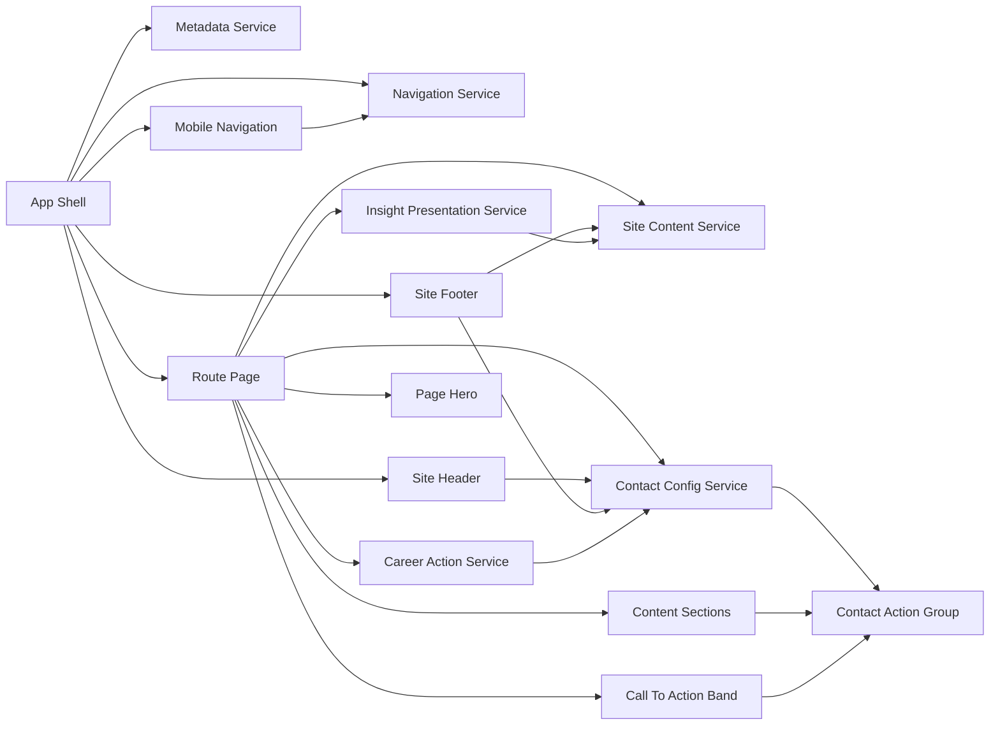

# Component Dependencies and Communication Patterns

## Dependency Principles
- Route components depend on services and presentation components, not on one another.
- Shared presentation components receive data through explicit props or view models; they do not fetch content directly.
- Centralized services are the only source of repeatable site content, contact configuration, navigation data, and metadata.
- Contact actions are resolved once through `ContactConfigService` and reused throughout the application.

## Dependency Diagram

### Text Alternative
The application shell uses navigation and metadata services, then renders the shared header, mobile navigation, selected route page, and footer. The selected route obtains centralized site content, contact configuration, and—where needed—insight or career presentation data. Shared header, footer, and page sections reuse the centralized contact configuration through the Contact Action Group. All route content ultimately renders through presentational components such as Page Hero, content sections, and Call To Action Band.

### Diagram Validation
- All Mermaid node identifiers are unique alphanumeric identifiers.
- Each node label is plain text and does not use unescaped diagram syntax.
- Each dependency uses valid `-->` flowchart syntax.
- The text alternative above conveys the full component flow without relying on the diagram.

## Dependency Matrix

| Consumer | Dependency | Communication pattern | Reason |
|---|---|---|---|
| `AppShell` | `NavigationService` | Reads route and active-item model. | Keeps route awareness and navigation consistency centralized. |
| `AppShell` | `MetadataService` | Reads page metadata for resolved route. | Produces accurate titles and descriptions. |
| `SiteHeader` and `SiteFooter` | `ContactConfigService` | Receives resolved contact actions. | Keeps channel display consistent and configurable. |
| `MobileNavigation` | `NavigationService` | Receives canonical route list and active state. | Preserves parity with desktop navigation. |
| Route pages | `SiteContentService` | Receive scoped read-only content model. | Prevents duplicate content definitions. |
| `InsightsPage` | `InsightPresentationService` | Receives populated or empty presentation state. | Avoids misleading content claims. |
| `CareersPage` | `CareerActionService` | Receives direct application-discovery action. | Centralizes the selected candidate contact behavior. |
| `CareerActionService` | `ContactConfigService` | Resolves configured email or WhatsApp channel. | Avoids career-specific duplication of contact endpoints. |
| Content sections and CTA bands | `ContactActionGroup` | Receive resolved actions as component input. | Uses the same accessible contact control everywhere. |

## Communication Patterns

### Route Rendering
1. The application resolves a canonical public route.
2. `NavigationService` identifies the active navigation item.
3. The route component requests its content model from `SiteContentService`.
4. The route requests metadata from `MetadataService`.
5. The route composes presentation components with explicit content and action inputs.

### Direct Contact
1. A shared or route component requests a channel from `ContactConfigService`.
2. The service returns a valid action when configured, or the approved labelled placeholder state if not.
3. `ContactActionGroup` renders the result in its contextual visual variant.
4. No contact form, network submission, or unconfigured external route is invoked.

### Navigation
1. Header and footer render canonical route links from `NavigationService`.
2. Mobile navigation uses the same data and controls its own visible state locally.
3. Route changes update the active navigation state and restore expected focus behavior.

## Coupling Controls
- Route pages must not import content data from each other.
- Presentational components must not depend directly on a specific route.
- Contact channels must not be hard-coded inside page components.
- The visual system may be shared through design tokens and style primitives, but those implementation details are selected later during NFR Design.
