# Careers Route Retirement Execution Plan

## Detailed Analysis Summary

### Transformation Scope

- **Project type**: Brownfield static Astro website.
- **Transformation type**: Single front-end route retirement; not an architectural or infrastructure transformation.
- **Primary change**: Remove the public Careers route and its route-specific data/types while preserving the six active public routes.
- **Related components**: Central navigation and page metadata in `src/content/site.ts`, route/type declarations in `src/types/site.ts`, and current build/test instructions.

### Change Impact Assessment

| Impact area | Assessment |
|---|---|
| User-facing | Yes. Careers is removed from desktop, mobile, and footer navigation; the legacy URL has no redirect. |
| Structural | No. The static Astro application, shared layout, header/footer behavior, sitemap configuration, and contact components remain unchanged. |
| Data model | No persistent-data impact. Only static route and content types are cleaned up. |
| API | No API or external contract change. |
| NFR | No new requirements. The existing production build and generated sitemap checks are sufficient. |

### Component Relationships

| Component | Change type | Reason | Priority |
|---|---|---|---|
| `src/pages/careers.astro` | Removal | Deletes the public route source. | Critical |
| `src/content/site.ts` | Minor | Removes the centralized navigation item, page metadata, empty careers export, and unused type import. | Critical |
| `src/types/site.ts` | Minor | Removes the retired route literal and unused `CareerOpportunity` interface. | Critical |
| Active build/test instructions | Minor | Updates route inventory and generated-output assertions from seven routes to six. | Important |
| Shared header/footer/layout/robots/sitemap configuration | No change | Navigation and sitemap derive from the retained central data and route set. | N/A |

### Risk Assessment

- **Risk level**: Low.
- **Rationale**: The removal is isolated to one route and central static data/types. No runtime service, persistence, package, infrastructure, or shared-component change is required.
- **Rollback complexity**: Easy. Restoring the deleted route and its references re-establishes the prior static behavior.
- **Testing complexity**: Simple. A production build plus generated-route, sitemap, navigation-identifier, and source-reference checks covers the affected contract.

## Workflow Visualization

### Mermaid Diagram

```mermaid
flowchart TD
    Start[Request] --> WD[Workspace Detection Completed]
    WD --> RE[Reverse Engineering Skipped]
    RE --> RA[Requirements Analysis Completed]
    RA --> US[User Stories Completed]
    US --> WP[Workflow Planning In Progress]
    WP --> AD[Application Design Skip]
    AD --> UG[Units Generation Skip]
    UG --> FD[Functional Design Skip]
    FD --> NFRA[NFR Requirements Skip]
    NFRA --> NFRD[NFR Design Skip]
    NFRD --> ID[Infrastructure Design Skip]
    ID --> CG[Code Generation Execute]
    CG --> BT[Build and Test Execute]
    BT --> End[Complete]

    style Start fill:#CE93D8,stroke:#6A1B9A,stroke-width:3px,color:#000
    style End fill:#CE93D8,stroke:#6A1B9A,stroke-width:3px,color:#000
    style WD fill:#4CAF50,stroke:#1B5E20,stroke-width:3px,color:#fff
    style RA fill:#4CAF50,stroke:#1B5E20,stroke-width:3px,color:#fff
    style US fill:#4CAF50,stroke:#1B5E20,stroke-width:3px,color:#fff
    style WP fill:#4CAF50,stroke:#1B5E20,stroke-width:3px,color:#fff
    style CG fill:#4CAF50,stroke:#1B5E20,stroke-width:3px,color:#fff
    style BT fill:#4CAF50,stroke:#1B5E20,stroke-width:3px,color:#fff
    style RE fill:#BDBDBD,stroke:#424242,stroke-width:2px,stroke-dasharray: 5 5,color:#000
    style AD fill:#BDBDBD,stroke:#424242,stroke-width:2px,stroke-dasharray: 5 5,color:#000
    style UG fill:#BDBDBD,stroke:#424242,stroke-width:2px,stroke-dasharray: 5 5,color:#000
    style FD fill:#BDBDBD,stroke:#424242,stroke-width:2px,stroke-dasharray: 5 5,color:#000
    style NFRA fill:#BDBDBD,stroke:#424242,stroke-width:2px,stroke-dasharray: 5 5,color:#000
    style NFRD fill:#BDBDBD,stroke:#424242,stroke-width:2px,stroke-dasharray: 5 5,color:#000
    style ID fill:#BDBDBD,stroke:#424242,stroke-width:2px,stroke-dasharray: 5 5,color:#000
    linkStyle default stroke:#333,stroke-width:2px
```

### Text Alternative

1. Workspace Detection, Requirements Analysis, and User Stories are complete; Reverse Engineering is not needed because the current implementation context already exists.
2. Workflow Planning is awaiting approval.
3. Application Design, Units Generation, Functional Design, NFR Requirements, NFR Design, and Infrastructure Design are skipped because the task retires an existing static route without new components, business rules, non-functional requirements, or infrastructure work.
4. Code Generation will remove the route and its central references.
5. Build and Test will validate the six active routes, generated sitemap, generated navigation, and source cleanup.

### Diagram Validation

- Node identifiers contain only letters and are unique.
- Labels use plain text without quotes or unescaped Mermaid syntax.
- Every edge uses the valid `-->` flowchart connection syntax.
- The text alternative provides an equivalent accessible representation.

## Phase Selection

### Inception

- [x] Workspace Detection — completed.
- [x] Requirements Analysis — completed and approved.
- [x] User Stories — completed and approved.
- [x] Workflow Planning — execution plan prepared; awaiting approval.
- [ ] Application Design — **Skip**.
  - **Rationale**: No new component, service, method, or business rule is needed. The removal is wholly within known component boundaries.
- [ ] Units Generation — **Skip**.
  - **Rationale**: The work is one small front-end unit with no decomposition, package, service, API, or schema requirement.

### Construction

- [ ] Functional Design — **Skip**.
  - **Rationale**: No new data model or complex business logic is introduced.
- [ ] NFR Requirements — **Skip**.
  - **Rationale**: Existing static-site performance, accessibility, and security practices are unchanged; no new NFR is introduced.
- [ ] NFR Design — **Skip**.
  - **Rationale**: NFR Requirements is skipped.
- [ ] Infrastructure Design — **Skip**.
  - **Rationale**: The repository does not configure hosting, redirects, or other infrastructure for this request.
- [ ] Code Generation — **Execute**.
  - **Rationale**: The route source and static content/types must be removed through an approved implementation plan.
- [ ] Build and Test — **Execute**.
  - **Rationale**: The final generated site must be validated against route, sitemap, navigation, and build acceptance criteria.

### Operations

- [ ] Operations — **Placeholder**.
  - **Rationale**: Deployment and hosting configuration are outside this route-retirement scope.

## Change Sequence

1. Remove the Careers route/type surface from `src/types/site.ts` and `src/content/site.ts`.
2. Delete `src/pages/careers.astro`.
3. Update active build and integration-test instructions for the six public routes and no Careers navigation scenario.
4. Build the site and inspect the generated output for route, sitemap, and navigation removal.
5. Record the validation outcome in the active build-and-test summary.

## Plan Preparation Checklist

- [x] Load approved requirements and user stories.
- [x] Map affected source, generated-output, and documentation surfaces.
- [x] Confirm the no-redirect static-host 404 decision.
- [x] Determine phase selections and single-unit sequence.
- [x] Validate Mermaid syntax, styling, and text alternative.
- [x] Create this execution plan.
- [x] Obtain execution-plan approval.

## Effort and Success Criteria

- **Remaining stages to execute after approval**: Code Generation and Build and Test.
- **Relative complexity**: Small.
- **Calendar estimate**: Not provided; the work is a contained single implementation unit.
- **Primary goal**: Retire the public Careers route without affecting the six remaining static pages.
- **Key deliverables**: Source cleanup, updated active test instructions, successful Astro build, and verification evidence that the generated site no longer contains Careers.
- **Quality gates**:
  1. `src/pages/careers.astro` is removed.
  2. Source navigation, metadata, content, and types no longer expose `/careers`.
  3. `npm run build` succeeds with exactly six generated public pages.
  4. Generated output has no `dist/careers/`, `/careers/` sitemap entry, or Careers navigation identifiers.

## Extension Compliance

| Extension | Status | Applicability |
|---|---|---|
| Resiliency Baseline | Disabled | N/A; no resiliency requirement is enabled for this route retirement. |
| Security Baseline | Disabled | N/A; no security extension is enabled for this route retirement. |
| Property-Based Testing | Disabled | N/A; no property-based testing extension is enabled for this route retirement. |
