# Execution Plan

## Detailed Analysis Summary

### Scope and Impact
- **Project type**: Greenfield public website.
- **Primary change**: Create a responsive, multi-page marketing website with a refreshed premium brand identity for Vital Tech Myanmar.
- **User-facing impact**: High. The site defines how prospective clients and candidates discover services, assess credibility, and reach direct contact routes.
- **Structural impact**: A single front-end application with reusable layout, page, content, navigation, and contact components.
- **Data model impact**: No persistent data store or backend model in the first release. Static, maintainable content structures are required.
- **API impact**: No custom API or contact-form submission service in the first release.
- **NFR impact**: Responsive behavior, accessibility, performance, SEO metadata, and direct-contact link integrity are material requirements.

### Risk Assessment
- **Risk level**: Medium.
- **Rationale**: The implementation is greenfield and has no backend or data migration risk, but it is a public brand surface with seven pages, multiple visitor journeys, and high expectations for visual quality, responsive behavior, and credibility.
- **Rollback complexity**: Easy before production release because there is no production site or persistent-data change in scope.
- **Testing complexity**: Moderate because all pages, navigation states, contact routes, small-screen behavior, and accessibility fundamentals require verification.

## Workflow Visualization

### Mermaid Diagram

```mermaid
flowchart TD
    Start[Start] --> WD[Workspace Detection - Completed]
    WD --> RE[Reverse Engineering - Skipped]
    RE --> RA[Requirements Analysis - Completed]
    RA --> US[User Stories - Completed]
    US --> WP[Workflow Planning - In Progress]
    WP --> AD[Application Design - Execute]
    AD --> UG[Units Generation - Skip]
    UG --> FD[Functional Design - Skip]
    FD --> NFRA[NFR Requirements - Execute]
    NFRA --> NFRD[NFR Design - Execute]
    NFRD --> ID[Infrastructure Design - Skip]
    ID --> CG[Code Generation - Execute]
    CG --> BT[Build and Test - Execute]
    BT --> End[Complete]

    style Start fill:#CE93D8,stroke:#6A1B9A,stroke-width:3px,color:#000
    style End fill:#CE93D8,stroke:#6A1B9A,stroke-width:3px,color:#000
    style WD fill:#4CAF50,stroke:#1B5E20,stroke-width:3px,color:#fff
    style RA fill:#4CAF50,stroke:#1B5E20,stroke-width:3px,color:#fff
    style US fill:#4CAF50,stroke:#1B5E20,stroke-width:3px,color:#fff
    style WP fill:#4CAF50,stroke:#1B5E20,stroke-width:3px,color:#fff
    style RE fill:#BDBDBD,stroke:#424242,stroke-width:2px,stroke-dasharray: 5 5,color:#000
    style UG fill:#BDBDBD,stroke:#424242,stroke-width:2px,stroke-dasharray: 5 5,color:#000
    style FD fill:#BDBDBD,stroke:#424242,stroke-width:2px,stroke-dasharray: 5 5,color:#000
    style ID fill:#BDBDBD,stroke:#424242,stroke-width:2px,stroke-dasharray: 5 5,color:#000
    style AD fill:#FFA726,stroke:#E65100,stroke-width:3px,stroke-dasharray: 5 5,color:#000
    style NFRA fill:#FFA726,stroke:#E65100,stroke-width:3px,stroke-dasharray: 5 5,color:#000
    style NFRD fill:#FFA726,stroke:#E65100,stroke-width:3px,stroke-dasharray: 5 5,color:#000
    style CG fill:#4CAF50,stroke:#1B5E20,stroke-width:3px,color:#fff
    style BT fill:#4CAF50,stroke:#1B5E20,stroke-width:3px,color:#fff
    linkStyle default stroke:#333,stroke-width:2px
```

### Text Alternative
1. Completed Inception stages: Workspace Detection, Requirements Analysis, and User Stories.
2. Workflow Planning is ready for approval.
3. After approval, execute Application Design, NFR Requirements, NFR Design, Code Generation, and Build and Test.
4. Skip Reverse Engineering, Units Generation, Functional Design, and Infrastructure Design because this is a greenfield, front-end-only website without existing code, complex business logic, backend services, or a selected hosting implementation.

### Diagram Validation
- Node identifiers use only letters and are unique.
- Labels contain plain text only; no unescaped quotes or special diagram syntax.
- Each connection uses valid `-->` flowchart syntax.
- The text alternative above provides the equivalent workflow sequence.

## Phases to Execute

### Inception Phase
- [x] Workspace Detection - **Completed**.
- [x] Reverse Engineering - **Skipped** because the workspace contains no existing application code.
- [x] Requirements Analysis - **Completed**.
- [x] User Stories - **Completed**.
- [x] Workflow Planning - **Completed; awaiting approval of this execution plan**.
- [ ] Application Design - **Execute**.
  - **Rationale**: The new site requires a defined component hierarchy, page composition, shared layout, reusable service and content patterns, navigation behavior, and configurable direct-contact strategy.
- [ ] Units Generation - **Skip**.
  - **Rationale**: The scope is one front-end application. There are no multiple services, packages, APIs, data models, or infrastructure units that warrant decomposition.

### Construction Phase
- [ ] Functional Design - **Skip**.
  - **Rationale**: The site has no complex business rules, calculations, data transformations, or stateful workflows. The required user behavior is already captured through stories and acceptance criteria.
- [ ] NFR Requirements - **Execute**.
  - **Rationale**: The new application needs a front-end technology decision and explicit implementation constraints for responsive behavior, accessibility, performance, search metadata, and usable direct-contact links.
- [ ] NFR Design - **Execute**.
  - **Rationale**: The selected NFR requirements must be translated into component, styling, asset, navigation, metadata, and verification patterns.
- [ ] Infrastructure Design - **Skip**.
  - **Rationale**: Hosting and deployment have been explicitly excluded from the first release.
- [ ] Code Generation - **Execute**.
  - **Rationale**: Build the new website and its reusable UI, page, content, navigation, and styling assets after code-generation planning approval.
- [ ] Build and Test - **Execute**.
  - **Rationale**: Verify production build output and the approved responsive, accessibility, navigation, contact-link, and content acceptance criteria.

### Operations Phase
- [ ] Operations - **Placeholder**.
  - **Rationale**: Deployment and monitoring are outside the current front-end-only release.

## Execution Sequence
1. **Application Design**: Define pages, shared components, service/content models, navigation, and contact-link configuration.
2. **NFR Requirements**: Select a front-end stack and define measurable responsive, accessibility, performance, and SEO expectations.
3. **NFR Design**: Specify patterns that make those NFRs concrete in the implementation.
4. **Code Generation**: Plan and implement the single website unit.
5. **Build and Test**: Validate the assembled application against stories and quality requirements.

## Estimated Effort
- **Stages to execute after approval**: 5.
- **Relative complexity**: Medium.
- **Calendar estimate**: Not set. It depends on availability of final company copy, logo and visual assets, case-study approval, careers details, and official direct-contact endpoints.

## Success Criteria
- **Primary goal**: Deliver a visually distinctive, credible, responsive Vital Tech Myanmar public website that clearly communicates its service portfolio and enables direct client contact.
- **Key deliverables**: Application design artifacts, NFR requirements and design artifacts, working front-end website, responsive styles, accessible navigation, SEO metadata, configurable contact links, and build-and-test instructions.
- **Quality gates**:
  1. All seven public pages and all user stories are represented.
  2. Software Development, Cloud, and DevOps are visually prioritized without obscuring System Integration or Managed IT.
  3. Phone, email, and WhatsApp links are configurable and valid when official endpoints are supplied.
  4. Keyboard navigation, visible focus states, semantic page structure, and readable contrast are verified.
  5. The production build completes successfully and the site works across supported viewport sizes.

## Extension Compliance
| Extension | Status | Applicability |
|---|---|---|
| Resiliency Baseline | Disabled | N/A; user opted out during Requirements Analysis. |
| Security Baseline | Disabled | N/A; user opted out during Requirements Analysis. |
| Property-Based Testing | Disabled | N/A; user opted out during Requirements Analysis. |
