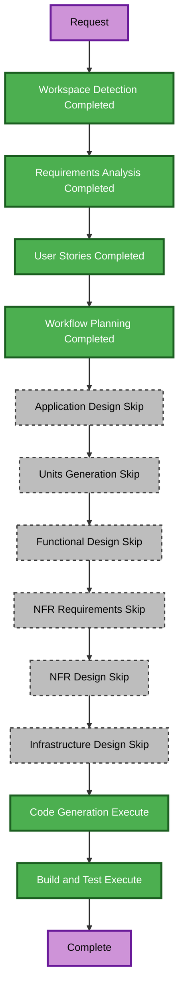

# Original Dark Technical Theme Refresh Execution Plan

## Detailed Analysis Summary

### Transformation Scope

- **Project type**: Brownfield Astro static site.
- **Transformation type**: Cross-cutting visual-system refresh within existing component boundaries; not an architectural, data, API, package, or infrastructure transformation.
- **Primary change**: Replace the light cobalt editorial system with an original dark technical system built from charcoal surfaces, warm readable neutrals, original ember-orange emphasis, and restrained secondary blue.
- **Preserved contract**: Six active routes, routes metadata, contact destinations, navigation labels, test identifiers, mobile-menu behavior, semantic landmarks, and static generation.

### Change Impact Assessment

| Impact area | Assessment |
|---|---|
| User-facing | Yes. All pages and shared interactive surfaces change visually. |
| Structural | No. Existing Astro layouts, components, route files, and Tailwind v4 CSS-first model remain. |
| Data model | No. No content schema or static data change. |
| API | No. No service, endpoint, or integration change. |
| NFR | Existing accessibility and responsive requirements are reinforced; no new stack or runtime requirement is introduced. |

### Component Relationships

| Component group | Change type | Reason | Priority |
|---|---|---|---|
| `src/styles/global.css` | Major visual-token update | Central color, typography, surface, focus, button, card, and ambient primitives. | Critical |
| Shared layout/chrome | Minor visual update | `BaseLayout`, `SiteHeader`, and `SiteFooter` propagate page shell, identity, navigation, and footer surfaces. | Critical |
| Shared content components | Minor visual update | `PageHero`, `ServiceCard`, `CallToAction`, `ContactActions`, `SectionHeading`, and `TechnologyEcosystem` apply shared visual language. | Critical |
| Route templates | Targeted visual correction | Replace local light/cobalt utility exceptions that conflict with the shared dark system. | Important |
| Static generation and sitemap | No change | Existing route-derived output remains the correct behavior. | N/A |

### Risk Assessment

- **Risk level**: Medium.
- **Rationale**: The work changes every visitor-facing surface, so contrast and responsive regressions are possible; however, source boundaries are well understood, no runtime integration changes occur, and rollback is a contained source reversion.
- **Rollback complexity**: Moderate. Centralized CSS and shared components make rollback straightforward, but implementation must keep local utility overrides consistent.
- **Testing complexity**: Moderate. Production build, source/reference checks, generated route/navigation checks, and browser review at narrow/wide viewports are required.

## Workflow Visualization

### Mermaid Diagram

### Text Alternative

1. Workspace Detection, Requirements Analysis, and User Stories are complete.
2. Workflow Planning is awaiting approval.
3. Application Design, Units Generation, Functional Design, NFR Requirements, NFR Design, and Infrastructure Design are skipped because existing components and Tailwind CSS tokens can implement the visual refresh without new business, data, infrastructure, or architectural design.
4. Code Generation will update the centralized visual system, shared components, and necessary route-local visual exceptions.
5. Build and Test will validate all six routes, navigation/contact continuity, generated static output, contrast/focus source patterns, and whitespace.

### Diagram Validation

- Node identifiers contain letters only and are unique.
- Labels contain plain text without quotes or invalid Mermaid syntax.
- All edges use the valid `-->` flowchart syntax.
- The text alternative provides an equivalent accessible description.

## Phase Selection

### Inception

- [x] Workspace Detection — completed.
- [x] Requirements Analysis — completed and approved.
- [x] User Stories — completed and approved.
- [x] Workflow Planning — execution plan prepared; awaiting approval.
- [ ] Application Design — **Skip**.
  - **Rationale**: No new component, service, public interface, or business rule is required; the refresh stays within known shared component boundaries.
- [ ] Units Generation — **Skip**.
  - **Rationale**: This is one front-end application with a single coordinated visual-refresh unit.

### Construction

- [ ] Functional Design — **Skip**.
  - **Rationale**: No data model, workflow, calculation, or business rule is added.
- [ ] NFR Requirements — **Skip**.
  - **Rationale**: Accessibility, responsive behavior, and performance constraints are already explicit in the approved requirements; no new technology choice is needed.
- [ ] NFR Design — **Skip**.
  - **Rationale**: NFR Requirements is skipped; the implementation applies existing semantic-token and accessible-component patterns.
- [ ] Infrastructure Design — **Skip**.
  - **Rationale**: No hosting, deployment, or infrastructure resource changes are requested.
- [ ] Code Generation — **Execute**.
  - **Rationale**: Implement the shared dark technical visual system and targeted local exceptions through an approved code-generation plan.
- [ ] Build and Test — **Execute**.
  - **Rationale**: Validate the build, static output, original-asset boundary, navigation/contact continuity, and responsive/accessibility source patterns.

### Operations

- [ ] Operations — **Placeholder**.
  - **Rationale**: No deployment or production operation is requested.

## Update Sequence

1. Establish original semantic color, type, surface, focus, motion, and primitive rules in `src/styles/global.css`.
2. Update shared layout and content components to consume the new visual primitives consistently.
3. Audit and correct route-local light/cobalt visual utilities, beginning with Home and Services, then About, Industries, Insights, and Contact.
4. Build and inspect generated output for all six active routes, preserved navigation identifiers, contact links, sitemap entries, and absence of retired-route output.
5. Perform focused visual review at narrow and wide viewport sizes, keyboard focus review, and repository whitespace validation.

## Success Criteria

- **Primary goal**: Deliver an original Vital Tech Myanmar dark technical visual system that feels confident, modular, and contemporary without copying the HashiCorp reference.
- **Key deliverables**: Updated shared style tokens, shared components, targeted route-level visual corrections, code-generation summary, and build/test evidence.
- **Quality gates**:
  1. No external font, asset, image, package, branded material, or copied layout is added.
  2. Six public routes, navigation test IDs, contact links, sitemap output, metadata, and interaction behavior remain unchanged.
  3. Dark surfaces, warm readable text, ember-orange primary emphasis, restrained secondary blue, focus states, and responsive behavior are consistently represented.
  4. `npm run build` and `git diff --check` pass.

## Extension Compliance

| Extension | Status | Applicability |
|---|---|---|
| Resiliency Baseline | Disabled | N/A; no resiliency behavior is introduced. |
| Security Baseline | Disabled | N/A; no security behavior is introduced. |
| Property-Based Testing | Disabled | N/A; no executable business logic is introduced. |
