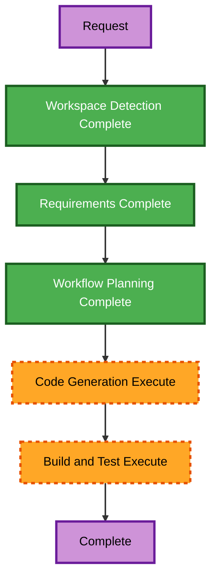

# Execution Plan — Local JPG Site Branding

## Detailed Analysis Summary

### Transformation Scope

- **Transformation type**: Single shared-layout presentation change.
- **Primary changes**: Replace the CSS `V` mark with the existing local JPG in the header; replace the shared SVG favicon link with the same JPG.
- **Affected components**: `src/components/SiteHeader.astro` and `src/layouts/BaseLayout.astro`.
- **Unchanged assets and behavior**: `public/og-preview.svg`, `public/favicon.svg`, page routes, content, navigation, contact links, test IDs, and mobile-menu behavior.

### Change Impact Assessment

- **User-facing change**: Yes — every page displays the uploaded mark in the shared header and uses it as the favicon.
- **Structural, data-model, API, and infrastructure change**: No.
- **NFR impact**: Low. The existing local static asset is already present; intrinsic dimensions prevent layout shift and no network dependency is added.

### Component Relationships

- **Primary component**: `SiteHeader.astro` renders the visible home-link identity.
- **Shared layout**: `BaseLayout.astro` emits the favicon on every route and composes the shared header.
- **Static asset**: `public/logo.jpg` is served directly as `/logo.jpg`.
- **Dependent pages**: All six active static routes inherit both changes through `BaseLayout`.

### Risk Assessment

- **Risk level**: Low.
- **Rollback complexity**: Easy — restore the two prior markup values.
- **Testing complexity**: Simple — build and inspect generated HTML for asset URLs, semantics, and route preservation.

## Workflow Visualization

Text alternative: Workspace detection and requirements analysis are complete. Workflow planning is ready for approval. Approved implementation will update the shared header and base layout, then rebuild and validate the static site.

## Phase Decisions

### Execute

1. **Code Generation** — Create a two-step source plan, obtain approval, then update the shared header image and favicon link.
2. **Build and Test** — Run `npm run build`, inspect all generated pages for `/logo.jpg` usage, retain shared semantics/test IDs, and run `git diff --check`.

### Skip

- **Reverse Engineering** — Current shared-layout context was verified and is not stale for this two-file change.
- **User Stories** — No user workflow, persona, behavior, or acceptance flow is introduced; this is a direct visual-identity asset substitution.
- **Application Design** — No new component, service, method, data model, or dependency is required.
- **Units Generation** — One simple unit with two coordinated shared-layout edits.
- **Functional Design** — No business logic or schema change.
- **NFR Requirements and NFR Design** — Existing static-asset and accessibility practices are sufficient; no new NFR target is introduced.
- **Infrastructure Design** — No hosting, deployment, service, or resource change.
- **Operations** — Placeholder only; no deployment action is in scope.

## Execution Sequence

1. Create and obtain approval for the detailed Code Generation plan.
2. Update `src/components/SiteHeader.astro` to render `/logo.jpg` as the decorative, fixed-height visual mark while retaining the existing wordmark, accessible home-link name, and test ID.
3. Update `src/layouts/BaseLayout.astro` to reference `/logo.jpg` as `image/jpeg` in the site-wide favicon link.
4. Build the static site and check generated HTML for both asset integrations, header semantics, six routes, and unchanged Open Graph image.
5. Run `git diff --check`.

## Success Criteria

- Header logo uses the user-supplied local JPG with intrinsic dimensions and preserved responsive behavior.
- Generated pages declare the JPG favicon and retain `/og-preview.svg` for social metadata.
- Shared home-link semantics, navigation, test ID, routes, and behavior remain unchanged.
- No new dependency, external request, or public asset conversion is introduced.
- Build and whitespace validation pass.

## Content Validation

The Mermaid flowchart uses simple alphanumeric node IDs, valid directed links, escaped-free labels, and the required style syntax. The text alternative provides an equivalent linear workflow. No other complex content appears in this document.

## Extension Compliance

| Extension | Status | Rationale |
|---|---|---|
| Resiliency Baseline | N/A | Disabled; no runtime resilience behavior changes. |
| Security Baseline | N/A | Disabled; no data, credential, or request boundary changes. |
| Property-Based Testing | N/A | Disabled; no business logic or transformation is added. |
