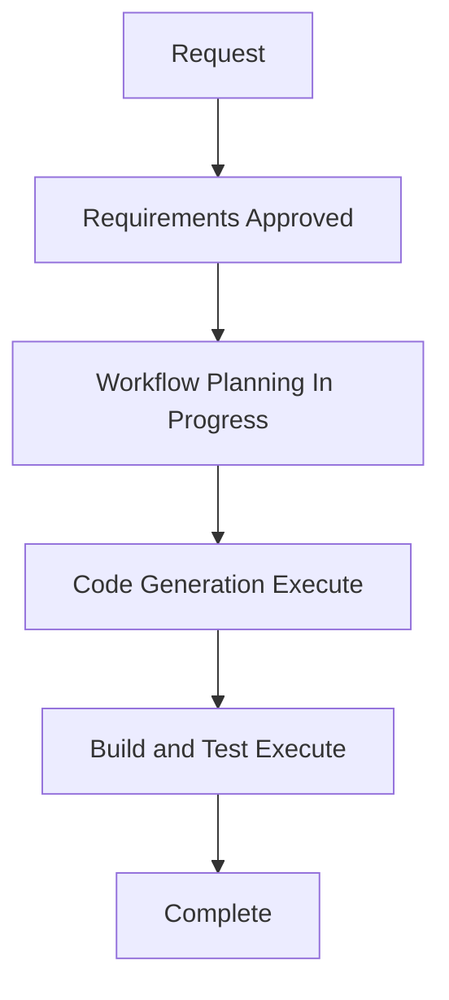

# README Documentation Execution Plan

## Detailed Analysis Summary

### Scope and Impact

- **Project type**: Brownfield Astro static website.
- **Change type**: Documentation-only addition.
- **Primary change**: Create a root `README.md` that accurately explains the existing project and its local workflow.
- **Affected application components**: None.
- **Affected documentation**: Root README only; existing build/test instructions remain the detailed validation reference.
- **User-facing behavior**: None. Generated site output, routes, content, and contact behavior are unchanged.
- **Risk level**: Low. The change adds one Markdown file and does not modify source, dependencies, configuration, or generated output.

## Workflow Visualization

### Mermaid Diagram

### Text Alternative

1. Requirements are approved.
2. Workflow Planning prepares the documentation-only execution plan.
3. Code Generation creates the root README.
4. Build and Test validates Markdown content and repository whitespace.
5. The workflow completes without deployment work.

### Diagram Validation

- Node identifiers use letters only and are unique.
- Labels use plain text without quotes or special Mermaid syntax.
- Each connection uses valid `-->` syntax.
- The text alternative supplies an equivalent non-visual representation.

## Phase Selection

### Inception

- [x] Workspace Detection — completed; existing Astro site and no root README confirmed.
- [x] Requirements Analysis — completed and approved.
- [x] User Stories — skipped; the change does not alter a user workflow or application behavior.
- [x] Workflow Planning — execution plan approved.
- [ ] Application Design — **Skip**.
  - **Rationale**: No component, service, method, or interface is added or changed.
- [ ] Units Generation — **Skip**.
  - **Rationale**: The change is a single documentation file with no module decomposition.

### Construction

- [ ] Functional Design — **Skip**.
  - **Rationale**: No business logic, data model, or rule is introduced.
- [ ] NFR Requirements — **Skip**.
  - **Rationale**: No non-functional behavior or technical stack selection changes.
- [ ] NFR Design — **Skip**.
  - **Rationale**: NFR Requirements is skipped.
- [ ] Infrastructure Design — **Skip**.
  - **Rationale**: No deployment, hosting, or infrastructure change is requested.
- [ ] Code Generation — **Execute**.
  - **Rationale**: Create the root README according to approved requirements.
- [ ] Build and Test — **Execute**.
  - **Rationale**: Inspect the resulting Markdown for all required sections and run `git diff --check`.

### Operations

- [ ] Operations — **Placeholder**.
  - **Rationale**: No operational action applies to a repository README addition.

## Execution Sequence

1. Create `README.md` at the workspace root using verified project data only.
2. Include project overview, technology stack, prerequisites, npm commands, six active routes, content/contact configuration, project structure, build output, and validation references.
3. Verify that the README has no Careers route, unverified deployment/license claims, secrets, remote embeds, or invalid Markdown constructs.
4. Run `git diff --check` and record the result.

## Success Criteria

- A concise root `README.md` exists and satisfies every approved requirement.
- Commands match `package.json` scripts.
- Routes, contact links, centralized content location, and generated-output handling match the repository.
- Application source, configuration, dependencies, and generated `dist/` files are unmodified.
- `git diff --check` passes.

## Extension Compliance

| Extension | Status | Applicability |
|---|---|---|
| Resiliency Baseline | Disabled | N/A; a README addition introduces no runtime or operational behavior. |
| Security Baseline | Disabled | N/A; no security behavior or credentials are changed. |
| Property-Based Testing | Disabled | N/A; no executable logic is added. |
