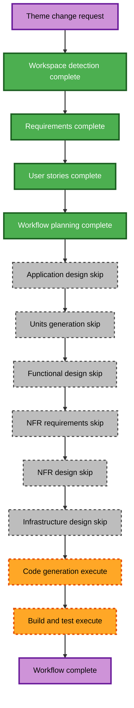

# Theme Change Execution Plan

## Detailed Analysis Summary

### Transformation Scope
- **Transformation type**: System-wide visual refresh within one static Astro application.
- **Primary changes**: Centralized light-theme tokens, typography, shared shell and component presentation, route-level editorial layouts, and cobalt-blue temporary visual assets.
- **Related components**: Global stylesheet, BaseLayout, seven shared components, all seven page routes, favicon, and Open Graph preview asset.

### Change Impact Assessment
- **User-facing changes**: Yes. Every route changes visual hierarchy and layout while retaining content and behavior.
- **Structural changes**: No. The Astro static architecture, content registry, metadata resolver, and direct-contact model remain unchanged.
- **Data model changes**: No.
- **API changes**: No.
- **NFR impact**: Moderate. Color contrast, focus styling, responsive layouts, reduced motion, and lightweight static delivery must be preserved.

### Component Relationships
- **Primary component**: Single Astro static website.
- **Shared presentation layer**: `src/styles/global.css`, BaseLayout, header, footer, hero, cards, CTA, section headings, and contact actions.
- **Page composition layer**: seven route files in `src/pages/`.
- **Preserved supporting layer**: typed content, metadata, routes, sitemap, robots directives, and direct-contact resolver.
- **Infrastructure and service dependencies**: None.

### Risk Assessment
- **Risk level**: Medium.
- **Rollback complexity**: Moderate; the change is source-controlled and restricted to presentation and static assets, but applies across every page.
- **Testing complexity**: Moderate; production build, source/static-output review, and manual browser accessibility review are required.

## Workflow Visualization

### Text Alternative
Workspace detection, requirements, user stories, and workflow planning are complete. Application Design, Units Generation, Functional Design, NFR Requirements, NFR Design, and Infrastructure Design are skipped because the work remains within existing presentation boundaries and uses the existing static architecture. Code Generation will update the visual system, shared components, pages, and temporary assets. Build and Test will run the production build and perform selected source/static-output checks.

## Phases to Execute

### Inception
- [x] Workspace Detection: Existing Astro implementation and documentation are current.
- [x] Requirements Analysis: Bright clean technology direction and scope approved.
- [x] User Stories: Theme-refresh stories and persona addendum approved.
- [x] Workflow Planning: This plan is ready for approval.
- [ ] Application Design: Skip. No new service, component boundary, method, or dependency is needed.
- [ ] Units Generation: Skip. One application and one coherent visual-refresh unit.

### Construction
- [ ] Functional Design: Skip. No new business logic or data model exists.
- [ ] NFR Requirements: Skip. Existing accessibility, performance, browser, and static-site decisions remain; visual acceptance criteria are captured in requirements.
- [ ] NFR Design: Skip. No new NFR pattern or runtime architecture is introduced.
- [ ] Infrastructure Design: Skip. Deployment and hosting remain out of scope.
- [ ] Code Generation: Execute. Update global tokens, shared components, all route compositions, and static visual assets without changing content or behavior.
- [ ] Build and Test: Execute. Run `npm run build`, inspect static output, and document manual browser-release checks.

### Operations
- [ ] Operations: Placeholder. No deployment, hosting, monitoring, or production configuration is included.

## Change Sequence
1. Establish centralized bright neutral, navy, and cobalt-blue tokens plus accessible global primitives.
2. Refresh the shared layout, header, footer, hero, buttons, contact treatments, cards, and CTA components.
3. Recompose all seven pages into a clean editorial layout, with Home prioritizing Software Development, Cloud, and DevOps after the hero.
4. Replace visual-only favicon and Open Graph artwork to match the new system.
5. Build and inspect static output; preserve route, metadata, contact placeholder, responsive-navigation, and accessibility behavior.

## Success Criteria
- All seven routes use the approved bright clean technology theme and editorial layout direction.
- Existing routes, content, direct-contact placeholders, metadata, sitemap, and mobile navigation remain functional.
- Temporary cobalt-blue treatments are clearly replaceable when final brand assets are supplied.
- The production build succeeds with no errors.
- Source/static-output checks confirm accessibility primitives and route coverage; browser and assistive-technology review remains a manual release check.
